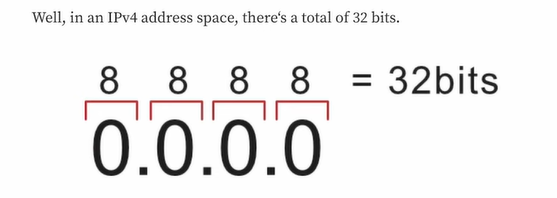
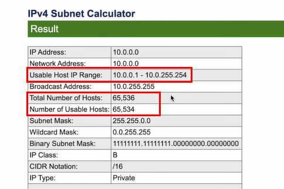
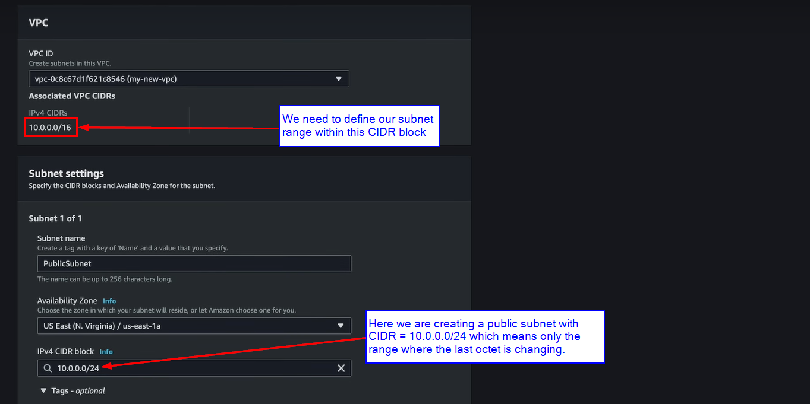
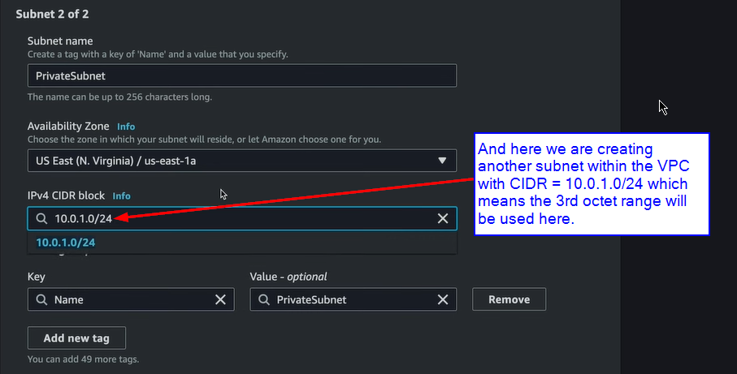
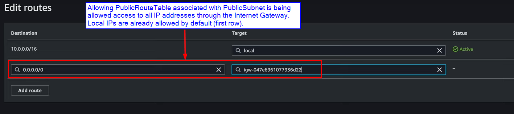
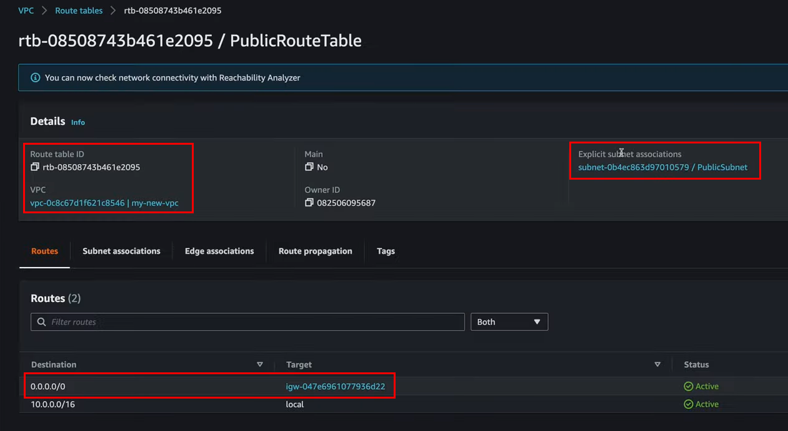
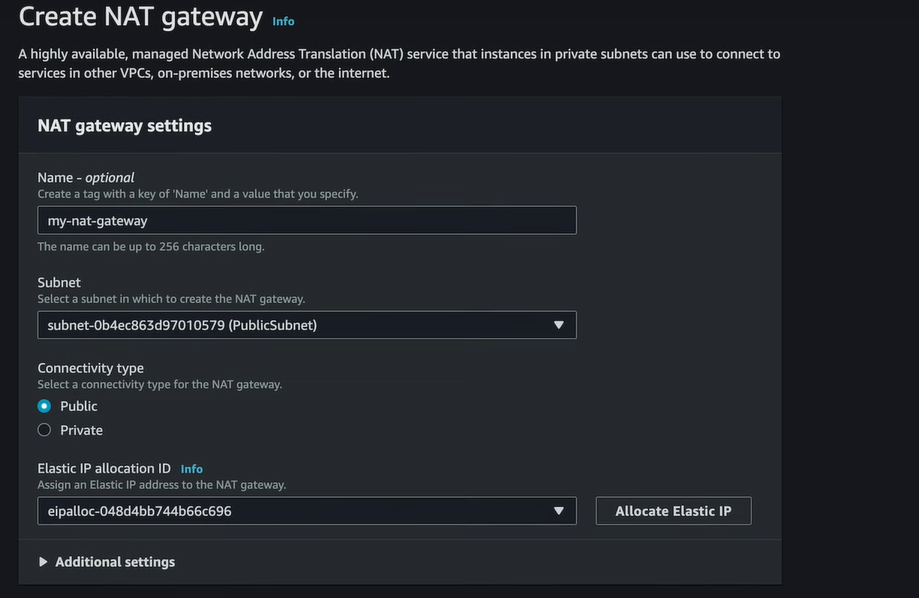
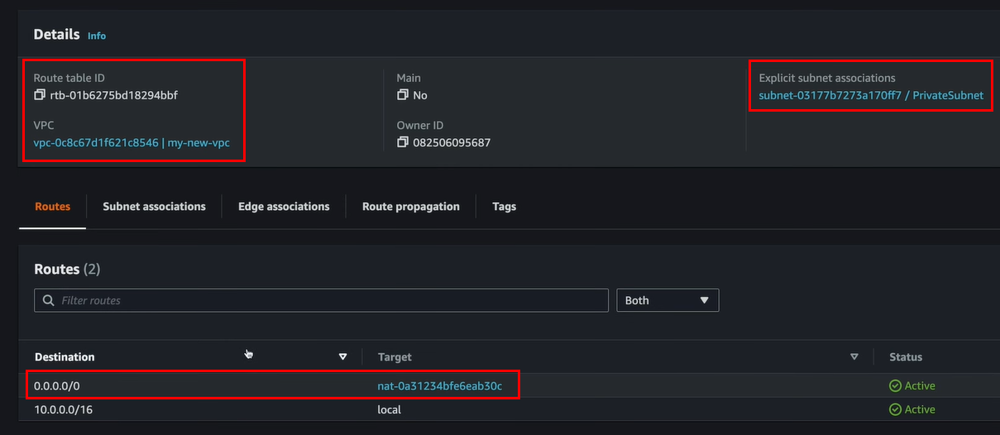
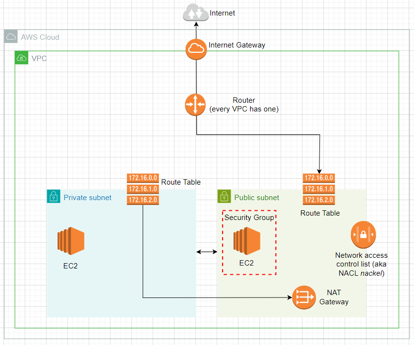

# VPC

VPC is a virtual private cloud to isolate all the resources within it. It is like a fence that keeps resources in one VPC separated from another.

# CIDR block/range

The IPv4 has 4 octets and each octet is 8 bit. So totally it makes 8 + 8 + 8 + 8 = 32 bits

### Okay, so what is the part after slash(/) that we see while creating VPC?

The Layman explanation is: the part after slash represents how many octets are fixed, with that we can calculate how many remaining octets can change.

Examples:

- 10.0.0.0/24 --> it means the first 3 octets are fixed, and only the last octet can change (first 3 octets take up 24 bits `8 + 8 + 8 = 24`, remaining last octet of 8 bits is free to change)
- 10.0.0.0/16 --> it means the first 2 octets are fixed, and only the last 2 octet range can change (first 2 octet take up 16 bits `8 + 8 = 16`)
- 10.0.0.0/8 --> it means only the first octet range is fixed, and the remaining 3 ranges can change.

## What does the part after slash(/) mean for me??

Basically with this we can allocate the range of IP addresses. The IP addresses range for `x.x.x.x/8` > `x.x.x.x/16` > `x.x.x.x/24`

- /24 --> range is 10.0.0.**1** - 10.0.0.**254**
- /16 --> range is 10.0.**0**.**1** - 10.0.**255**.**254**
- /8 --> range is 10.**0**.**0**.**1** - 10.**255**.**255**.**254** 

> The `10.0.0.0/16` CIDR is usually chosen as it provides a decent range of IP addresses (**65,536** IP addresses to be exact).

# Subnet

Subnet's holds a defined set of IP addressess range contained within the VPC. The IP addressess range should be within the CIDR range of the VPC we have set while creating the VPC (from our example above it should be in 10.0.0.0/16 i.e., only last 2 octet range are dynamic).

For example, here we are creating one subnet called as PublicSubnet inside a VPC allocating the last octet range for this one -

And then creating another subnet called as PrivateSubnet within the VPC allocating the 3rd octet range for this one -

> [!NOTE]
> We must have a subnet within the VPC to launch any resources. We get some default subnets once VPC is created, but it is better if we create our own subnet's.

# Security Group

It acts as a virtual firewall for our EC2 instances to control incoming and outgoing traffic.

It is related to EC2 instance only.

# Gateway (Internet Gateway to be specific)

Gateway in general connects our VPC to another network. Internet gateway is a way for our VPC to connect to the Internet. But there are other gateways like Transit Gateways, NAT Gateways etc.

> [!IMPORTANT]
> We can only have 1 Internet Gateway per VPC.

# Route Tables

Route tables are the way through which we allow our subnet(s) to connect to the Gateway. Just attaching a VPC with a Gateway like Internet Gateway does not allow all contained subnets to use the Gateway (**security!!**).

Continuing with our above example, we would most likely want to allow the PublicSubnet to connect to the Internet Gateway but not the PrivateSubnet.

Some other important information on route tables -

- Route tables already allow communication between the subnets, its only for the subnets that need to communicate with a Gateway we need to set the route table to achieve the same.
- Our VPC already comes with a route table, it is called the "main" route table. All unassociated subnets uses this main subnet, that's the way they can communicate with each other.

Once we create a route table and associate it with a subnet (in our example PublicSubnet), below is how we can connect the route table to our gateway (Internet Gateway in our example) -

# NAT Gateway

NAT gateway is Network Address Translation service, it is used to allow instances within a private subnet reach out to the Internet through the public subnet.

Whenever the private instance need to reach out to the internet (say it needs to update packages), it will reach out to the NAT gateway sitting in our public subnet (remember communication between subnets are already allowed through main route table).

> [!IMPORTANT]
> External traffic is only allowed to go out from the private instance through NAT gateway, not the other way round. So we can think it is just outgoing traffic.

Creating NAT gateway in the PublicSubnet -

Configuring the route table associated with our PrivateSubnet to communicate with the NAT gateway -

# Network access control list

It is like a virtual firewall that protects an entire subnet (just like Security Group is a firewall for EC2 instance).

It is stateless i.e., if we allow something to come into the subnet, it does not remember that and hence we should also allow it explicitly to go out as well (we must also have a corresponding outbound rule for every inbound rule).

> [!NOTE]
> Unlike network access control list, security groups (associated with EC2) are statefull which means when we add a rule to allow an inbound connection, its corresponding outgoing rule comes along with it.

Most of the time we leave it as default, and the default configuration is it allows everything in and out. And it is not an issue because we already have setup routes and security groups.

One use case of it is - if we want to block an IP address at the subnet level.

# AWS Networking

# References

- [Travis Media](https://youtu.be/2doSoMN2xvI)
- [AWS networking essentials](https://aws.amazon.com/getting-started/aws-networking-essentials/)
